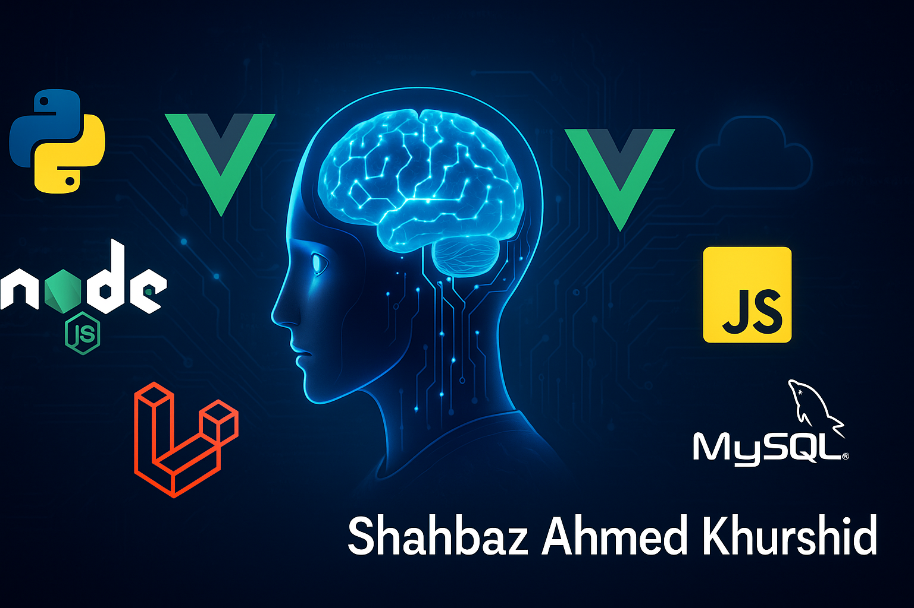

# Hi, I'm Shahbaz Ahmed Khurshid

 Full Stack Developer | Laravel & Node Expert | Vue & React Enthusiast | Agentic AI | Freelancer from Lahore, Pakistan

---


##  About Me

I'm a passionate and results-driven Full Stack Developer with over **10+ years** of experience building scalable web and mobile applications using:

- **Backend:** Laravel, PHP, Node.js, Python
- **Frontend:** Vue.js, React.js, React Native, Alpine.js
- **Databases:** MySQL, PostgreSQL, MongoDB
- **DevOps:** Docker, AWS EC2/S3, GitHub Actions, CI/CD
- **WordPress:** Theme & Plugin Development, Custom Integrations
- **AI & Data Science:** Python (Pandas, NumPy, Scikit-learn), Elasticsearch, LLM APIs, LangChain

---
## Languages & Frameworks

|  <br> HTML5 |  <br> CSS3 |  <br> Tailwind |  <br> Bootstrap |
| :--: | :--: | :--: | :--: |
|  <br> JavaScript |  <br> TypeScript |  <br> React |  <br> Next.js |
|  <br> Redux |  <br> Vue.js |  <br> Node.js |  <br> Express.js |
|  <br> MongoDB |  <br> MySQL |  <br> PostgreSQL |  <br> AWS |

---

## 💼 Hire Me

| [](https://www.fiverr.com/shehbaz2009) | [](https://www.upwork.com/freelancers/~016883136522f6b623) |
| :--: | :--: |


---
## What I'm Working On

- **AI-Driven Developer Tools:** Building intelligent agents using LLMs to automate development workflows.
- **Abacus Learning App:** A Nuxt + Laravel-based mobile/web platform for abacus learners.
- **Custom WordPress Plugins:** From event management to search console automation and peer-to-peer auctions.
- **MCP (Model Context Protocol) & Agentic AI:** A local AI agent system using LM Studio + LangChain.

---

## Goals

- Become a Project/Product Manager at a global tech company like Google.
- Launch a **unique, big product** that solves real-world problems and *rocks the internet*.
- Explore more into **LLMs, DevOps, AI agents**, and scalable SaaS systems.

---

## Tech Stack

```bash
💻 Languages:    PHP, JavaScript, TypeScript, Python, Bash
🌐 Frameworks:   Laravel, Vue.js, React.js, Nuxt, Next.js
📦 Tools:        Docker, GitHub Actions, Stripe, Firebase, Tailwind CSS, Webpack
🔍 Search:       Elasticsearch, Meilisearch
🧠 AI:           OpenAI API, LangChain, Local LLMs (LM Studio, GPT4All)
🗃️ Databases:    MySQL, PostgreSQL, MongoDB, Supabase
